# Ambiente AWS

Configuração utilizada no experimento. Ajuste os nomes de bucket/região conforme seu ambiente.

## Serviços e região
- **Região:** us-east-1 (Norte da Virgínia)
- **Armazenamento:** Amazon S3
- **Motor de consulta:** Amazon Athena (baseado em Presto/Trino)
- **Grupo de trabalho:** `primary`, com atualização automática de versão
- **Mecanismo de análise:** **Athena engine version 3**
- **Formato de cobrança:** US$ 5,00 por terabyte de dados varrido, arredondado para o
  megabyte superior, com **cobrança mínima de 10 MB por consulta**

O registro da versão do mecanismo é relevante para a reprodutibilidade: versões distintas do
motor adotam estratégias diferentes de planejamento, paralelismo e leitura de arquivos
colunares, de modo que os tempos medidos neste experimento são específicos da engine v3.

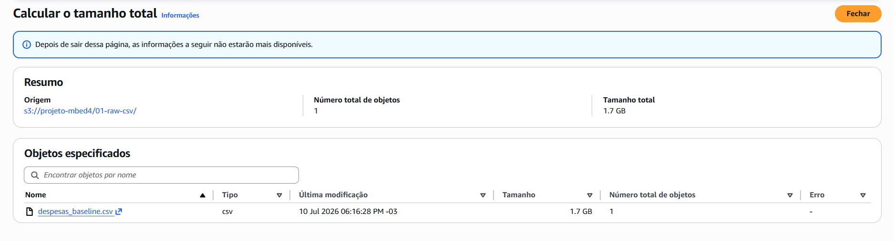

## Origem dos dados

Os 36 arquivos mensais de Despesas — Execução da Despesa são obtidos no Portal da
Transparência, no período de janeiro/2023 a dezembro/2025.

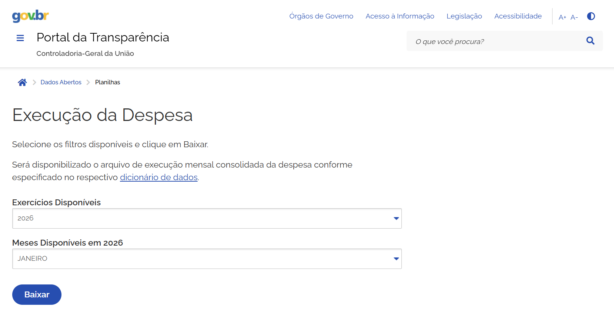

Após o download, os arquivos brutos ficam em um diretório local, ainda em ISO-8859-1 e com
separador `;` — o script `01_limpeza_dados_brutos.py` consolida e trata esse conjunto.

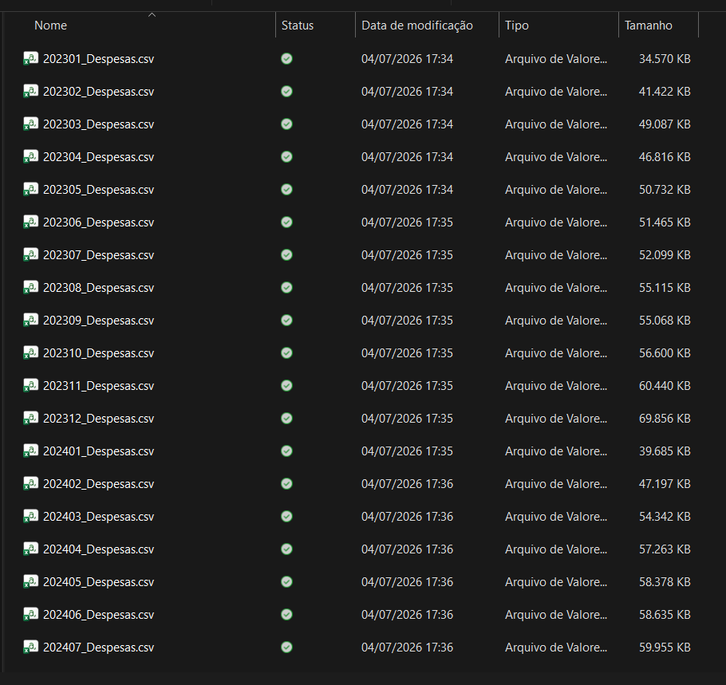

## Bucket e organização
```
s3://<seu-bucket>/
├── 01-raw-csv/                     CSV consolidado (baseline)
├── 02-csv-particionado/            CSV particionado por ano/mês
├── 03-parquet-snappy/
├── 04-parquet-snappy-particionado/
├── 05-parquet-gzip/
├── 06-parquet-gzip-particionado/
├── 07-parquet-zstd/
├── 08-parquet-zstd-particionado/
├── 09-parquet-gzip-unico/          teste de consolidação (1 arquivo)
├── 10-parquet-gzip-part-unico/     teste de consolidação (1 arq/partição)
└── athena-results/                 saída das consultas
```

Um prefixo por layout, o que permite conferir tamanho e número de objetos de cada arranjo
diretamente no console do S3.

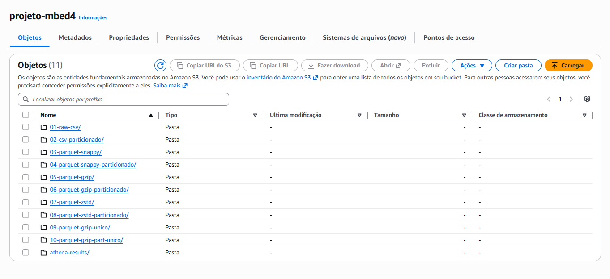

Nos layouts não particionados, os arquivos de dados ficam diretamente sob o prefixo do layout
(10 arquivos, resultado do paralelismo de escrita do motor).

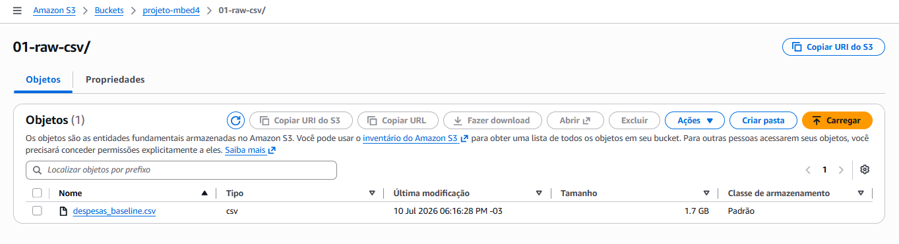

Nos layouts particionados, o CTAS grava a estrutura hierárquica `ano=XXXX/mes=YY/` — 36
partições no total, cada uma com 10 arquivos.

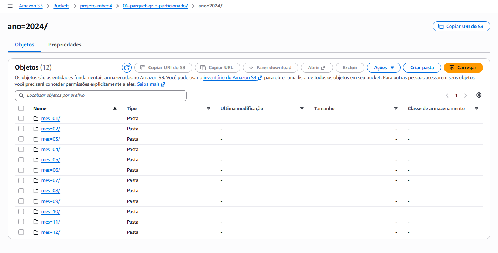

### Armazenamento por layout

O tamanho ocupado por cada layout é conferido no console do S3, prefixo a prefixo. Esses valores
correspondem às Tabelas 5 e 6 do artigo e estão consolidados em
[`resultados/armazenamento_s3.csv`](../resultados/armazenamento_s3.csv).

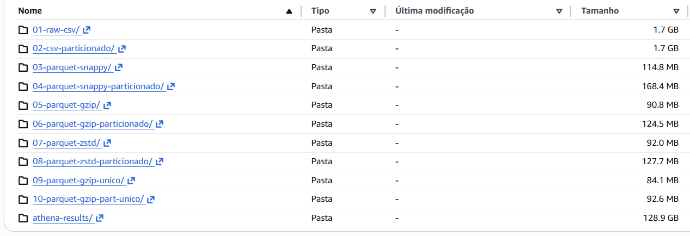

Para os prefixos exibidos apenas em GB, usa-se a função "Calcular o tamanho total", que detalha os
subprefixos — no caso do `csv_particionado`, um por ano.

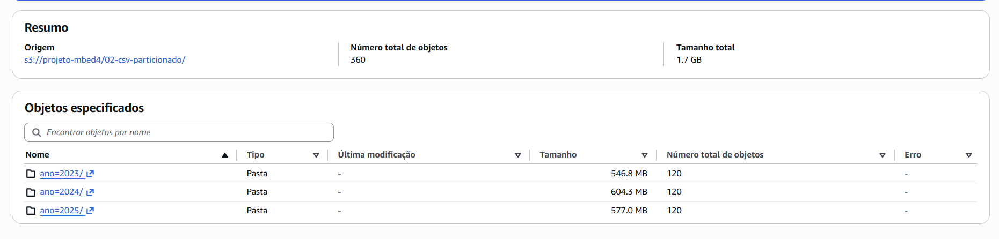

O prefixo `01-raw-csv/` contém um único objeto, o CSV consolidado. Como o console arredonda esse
valor para 1,7 GB, o tamanho exato foi obtido das propriedades do próprio arquivo.

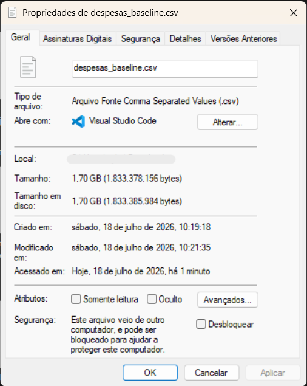

## Salvaguardas de custo (recomendado)
- **AWS Budget mensal** com alerta automático (ex.: US$ 10).
- **Data scanned limit por consulta** no grupo de trabalho do Athena (ex.: 2 GB), para cancelar automaticamente qualquer consulta que exceda o limite. Protege contra varreduras acidentais.
- **Limpeza do prefixo `athena-results/`:** cada execução grava seu resultado no S3. Ao longo de um benchmark com repetições, esse prefixo acumula dezenas de gigabytes e passa a gerar custo de armazenamento. Configure uma regra de ciclo de vida para expirar os objetos, ou esvazie o prefixo ao final.

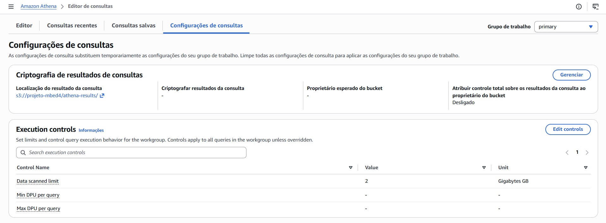

## Protocolo de medição
- **Cache desabilitado:** desligar "Reutilizar resultados da consulta" no editor do Athena antes de medir tempos. Com o cache ativo, execuções repetidas retornam resultados pré-computados e os tempos não refletem processamento real.
- **5 execuções por combinação**, consecutivas, na mesma sessão. Reporta-se mediana e desvio-padrão.
- **Volume varrido** é determinístico (uma medição basta); apenas o **tempo** é repetido.

Após a execução dos scripts 02, 03 e 05, o database `projeto_despesas` contém as dez tabelas
do experimento.

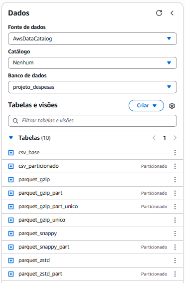

Cada consulta é executada no editor com o marcador de identificação em comentário (ver script 04)…

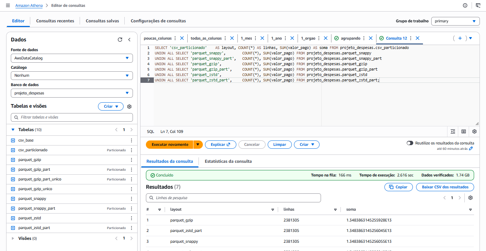

…e o painel de resultados informa as duas métricas primárias: tempo de execução e volume de
dados varrido.

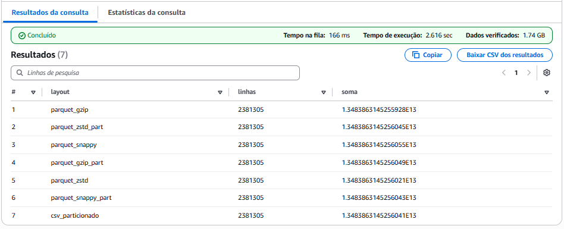

## Verificação de integridade
Após materializar cada layout, confirmar:
- Contagem de registros = **2.381.305**
- Soma de controle (`SUM(valor_pago)`) = **R$ 13.483.863.145.256,05**
  (variações na última casa decimal são arredondamento de ponto flutuante, não perda de dado)

Para tabelas particionadas que retornem 0 linhas logo após a criação:
```sql
MSCK REPAIR TABLE projeto_despesas.<nome_da_tabela>;
```
